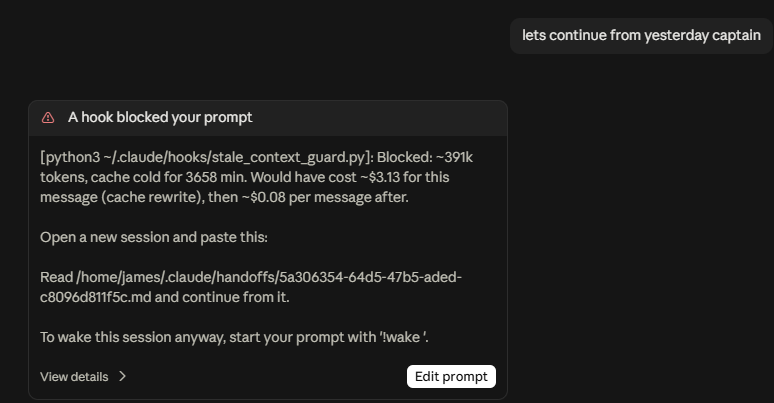

# claude-handoff-guard

Two Claude Code hooks that keep sessions from getting expensive: one blocks messages into a session whose prompt cache has expired, the other rolls a session over to a fresh one once its context passes a token limit. Both write a handoff note so the work carries on.



## Why

Claude Code's prompt cache expires after an hour idle (five minutes on some setups). The next message to that session re-writes the whole context at the cache-write price, which is 2x the input price on the 1-hour cache. On a 400k-token session that is several dollars for one message.

## What it saved me

I ran `usage_report.py` over my first two weeks of transcripts (126 sessions, about $885 at API list prices):

| | |
|---|---|
| Cold-cache restarts | 9 |
| Avoidable cost of those restarts | **$24.30** (2.7% of spend) |
| Worst single restart | $8.22 (416k tokens, resumed after 1.6 hours) |

That is what the hook would have intercepted. It went live after this period, so I don't have a before-and-after saving yet. Most of my spend was ordinary long sessions: 43% re-reading cached context, 30% cache writes as sessions grew, 27% output. Dead-cache restarts were a small leak, so how much you gain depends on how often you resume old sessions. Run the report on your own data first.

## Install

```bash
git clone https://github.com/JA-Marshall/claude-handoff-guard
cd claude-handoff-guard
python3 install.py
```

`install.py` copies both hooks to `~/.claude/hooks/`, registers them in `~/.claude/settings.json` (backing the file up first) and writes a default config. It applies from your next prompt, with no restart. Run it in the same environment as Claude Code, so inside WSL if that is where you run it.

## How it works

1. On each prompt, the hook reads the session transcript and finds the token count, model and idle time.
2. If the session is over `min_tokens` and idle past its cache lifetime, the prompt is blocked with exit code 2. The lifetime is read from the transcript, so 1-hour and 5-minute caches are both handled.
3. The cost shown is the cache write at that model's real price, plus the per-message cache-read price after.
4. A separate model reads the transcript file and writes a structured note: goal, current state, done, in progress, decisions, files and commands, open questions, next step. The old context is never re-sent to Claude.
5. The note is saved to `~/.claude/handoffs/<session>.md`, with the exact prompt the summariser received next to it as `<session>.prompt.txt`.

If summarising fails you still get the block and the error. Start any prompt with `!wake ` to get through.

## Configure

Edit `~/.claude/handoff-guard.json`. Every key is optional.

| Key | Default | Meaning |
|---|---|---|
| `enabled` | `true` | Turn the hook off without uninstalling |
| `min_tokens` | `50000` | Only guard sessions at least this large |
| `cold_after_minutes` | auto | Idle time counted as cold. Auto is the cache lifetime minus a margin: 55 (1h) or 4 (5m) |
| `override_prefix` | `"!wake "` | Prefix that lets a prompt through |
| `output_dir` | `~/.claude/handoffs` | Where notes are written |
| `budget_chars` / `head_chars` | `400000` / `40000` | Transcript sent to the summariser; the start is always kept and the middle trimmed |
| `timeout_seconds` | `240` | Summariser timeout; keep the hook timeout above it |
| `summariser.provider` | `"claude"` | `"claude"` uses your login via `claude -p`; `"openai"` uses any OpenAI-compatible API |
| `summariser.model` | `"sonnet"` | Model for that provider |
| `summariser.claude_path` | | Path to `claude` if not `~/.local/bin/claude` |
| `summariser.base_url` | | OpenAI-compatible base URL, e.g. `https://host/v1` |
| `summariser.api_key_env` | | Name of the env var holding the key |
| `summariser.api_key_file` | | Or a file containing only the key (`chmod 600`), read on every run |
| `prices` | see script | `{"model-id-substring": [input, cache_read]}` in $ per 1M tokens; the longest match wins |

Environment overrides: `HANDOFF_GUARD_CONFIG`, `HANDOFF_GUARD_MODEL`, `HANDOFF_GUARD_MIN_TOKENS`, `HANDOFF_GUARD_COLD_MINUTES`, `HANDOFF_GUARD_DISABLE`.

Example using Meta's Muse Spark as the summariser:

```json
{
  "summariser": {
    "provider": "openai",
    "model": "muse-spark-1.3",
    "base_url": "https://api.meta.ai/v1",
    "api_key_env": "MODEL_API_KEY"
  }
}
```

Keep keys out of the config file and out of git.

## Roll over at a context limit

`context_rollover.py` is a second hook, on `Stop`, for the other way a session gets expensive: it just keeps growing. When the context passes `rollover.max_tokens` (200k by default) it makes Claude write a handoff note before it stops, then starts a new session from that note and tells you its id. The old session is left for you to close.

1. At the end of a turn the hook reads the token count from the transcript, the same way the guard does.
2. Over the limit, it keeps Claude going with one instruction: write the handoff note, using the same sections the guard's summariser uses. Claude drafts it in the session scratchpad, so there is no permission prompt, and the hook moves it to `~/.claude/handoffs/<session>.md`.
3. At the next stop the hook runs `claude --bg` in the same directory with the note as the first message, named `handoff <id>`, and shows the new session id with the `claude attach` line to open it. If Claude did not write the note, the guard's summariser writes one from the transcript instead.

`claude --bg` needs the directory to be trusted by the CLI. If it is not, the hook shows the note path and a line to paste into a session you open yourself. Run `claude` once in that directory from a terminal and accept the trust prompt to enable the automatic launch.

Keys under `rollover` in `~/.claude/handoff-guard.json`, all optional:

| Key | Default | Meaning |
|---|---|---|
| `enabled` | `true` | Turn the rollover off without uninstalling |
| `max_tokens` | `200000` | Context size that triggers the rollover |
| `mode` | `"self"` | `"self"`: Claude writes the note from its own context. `"summariser"`: the guard's summariser writes it from the transcript, with no extra turn on the large session |
| `launch` | `"bg"` | `"bg"` starts the new session with `claude --bg`; `"none"` just prints the paste line |
| `model` | | Model for the new session; blank uses your default |
| `permission_mode` | | Permission mode for the new session; blank copies the stopping session's |
| `claude_path` | | Path to `claude` if not `~/.local/bin/claude` |

Environment overrides: `HANDOFF_ROLLOVER_MAX_TOKENS`, `HANDOFF_ROLLOVER_MODE`, `HANDOFF_ROLLOVER_LAUNCH`, `HANDOFF_ROLLOVER_MODEL`, `HANDOFF_ROLLOVER_DISABLE`. They are not passed on to the new session, so a low test limit cannot chain. `HANDOFF_ROLLOVER_LOG=path` appends every Stop event the hook sees, for debugging.

```bash
python3 ~/.claude/hooks/context_rollover.py --check            # tokens in the latest session
python3 ~/.claude/hooks/context_rollover.py --check session.jsonl
```

## Usage report

```bash
python3 usage_report.py                  # everything in ~/.claude/projects
python3 usage_report.py --days 14        # last two weeks
python3 usage_report.py dir1 dir2        # several projects directories
```

It estimates spend from token usage, counts cold-cache restarts, and shows the share of spend they cost, broken down by model, with the costliest restarts. These are API list prices, not your plan's billing, and subagent transcripts are not included.

## Handoff on demand

```bash
python3 ~/.claude/hooks/stale_context_guard.py --latest          # most recent session
python3 ~/.claude/hooks/stale_context_guard.py path/to/session.jsonl
```

## Limits

- Cost figures ignore output and thinking tokens, and the 1.1x US-only inference multiplier.
- Summarising takes seconds to a couple of minutes, depending on the model and session size (about 2 minutes for a 385k-token session with Muse Spark 1.3).
- A handoff is only as good as the transcript. If a note is thin, read its `.prompt.txt` to see what the model was given.

MIT licensed.
